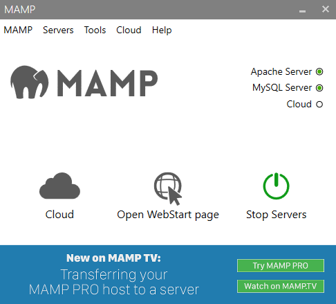
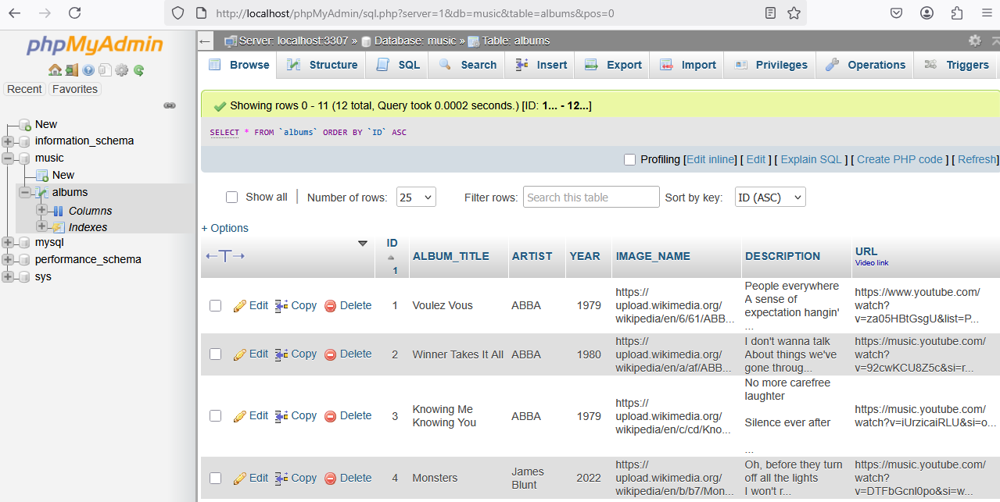

# $\textcolor{green}{\textsf{S}}$ tandard $\textcolor{green}{\textsf{Q}}$ uery $\textcolor{green}{\textsf{L}}$ anguage Database Apps

1.  Build a SQL database
2.  Build a front end app
3.  Connect DB to app

## Staging Development Environment
1. Install [MySQL server](https://www.bing.com/ck/a?!&&p=502f111fccd428efc50a4a33a6dd0cbe490c2e7f4b80ea67cf789df21b6e460eJmltdHM9MTc0MTMwNTYwMA&ptn=3&ver=2&hsh=4&fclid=049b1723-791c-604f-01c5-02b4784261c3&psq=mysql+download+for+windows+11&u=a1aHR0cHM6Ly9kZXYubXlzcWwuY29tL2Rvd25sb2Fkcy8&ntb=1)
2. Install [MAMP](https://www.bing.com/ck/a?!&&p=2d1e0510670580990cb5e56ab2921436f535ea33cb9e6cb20ddc0123556e040aJmltdHM9MTc0MTMwNTYwMA&ptn=3&ver=2&hsh=4&fclid=049b1723-791c-604f-01c5-02b4784261c3&psq=mamp+download&u=a1aHR0cHM6Ly93d3cubWFtcC5pbmZvL2VuL2Rvd25sb2Fkcy8&ntb=1)

3. Install [Visual Studio 2022 Community Ed.](https://visualstudio.microsoft.com/vs/community/)




**Create a database named `music` with table `albums`**

```mysql
Field 	Type 	Null 	Key 	Default 	Extra 	
ID 	int(11) 	NO 	PRI 	NULL 	auto_increment
ALBUM_TITLE 	varchar(100) 	NO 		NULL 	
ARTIST 	varchar(100) 	NO 		NULL 	
YEAR 	year(4) 	NO 		NULL 	
IMAGE_NAME 	varchar(500) 	NO 		NULL 	
DESCRIPTION 	text 	NO 		NULL 	
URL 	varchar(200) 	NO 		NULL 	

```



## Front end app

Create a C# Windows Form Desktop application using Visual Studio 2022 with .NET 8.0 framework.
1. Create a windows form
2. Create an Album class
3. Create an Albun Data Access Object class
